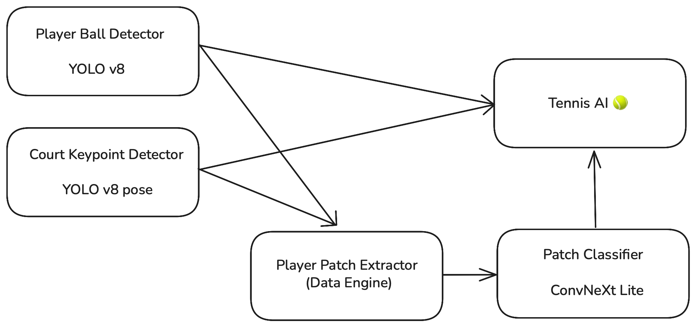

# Court-Analytic-Yolo-Approach

## Abstract
- This system aims to categorize the tennis shots played in a match video
- It uses YOLO v8 and YOLO v8 pose as its backbone
- In addition to the positional information captured by YOLO, we'll need to distinguish whether a shot is a forehand, bakchand, or serve in order to categorize that shot (e.g. a forehand inside out and a back hand cross court can have identical trajectory). This is done by a separate light weight convnet which we trained.

## Flow chart


## Demo


## Reference
- The ConvNeXt was build on the implementation from [CovNeXt](https://github.com/facebookresearch/ConvNeXt).
- Our implementations took reference from [Roboflow Sports repo](https://github.com/roboflow/sports)

Dataset management and annotation were performed using Roboflow.

This work uses YOLOv8, developed by Ultralytics.
```bibtex
@software{ultralytics_yolov8,
  author       = {Jocher, Glenn and Chaurasia, Ayush and Qiu, Jing},
  title        = {YOLOv8},
  year         = 2023,
  publisher    = {Ultralytics},
  url          = {https://github.com/ultralytics/ultralytics}
}
```

